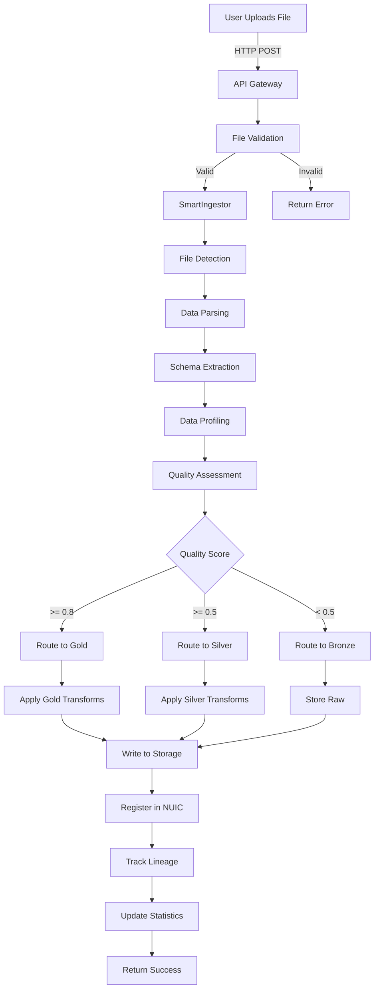
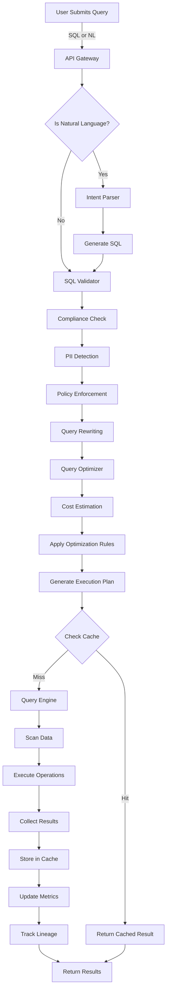
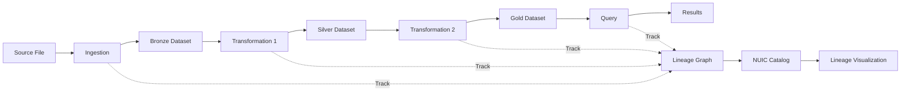

# NeuroLake Platform - Complete Architecture & Flow Diagrams

**Version**: 1.0
**Date**: November 7, 2025
**Status**: Production Ready

---

## Table of Contents

1. [High-Level Platform Architecture](#1-high-level-platform-architecture)
2. [Component Architecture](#2-component-architecture)
3. [Data Flow Architecture](#3-data-flow-architecture)
4. [API Architecture](#4-api-architecture)
5. [Module Dependency Graph](#5-module-dependency-graph)
6. [Ingestion Flow](#6-ingestion-flow)
7. [Query Execution Flow](#7-query-execution-flow)
8. [Lineage Tracking Flow](#8-lineage-tracking-flow)
9. [Deployment Architecture](#9-deployment-architecture)
10. [Technology Stack](#10-technology-stack)

---

## 1. High-Level Platform Architecture

```
┌─────────────────────────────────────────────────────────────────────────────┐
│                         NEUROLAKE PLATFORM                                   │
│                    AI-Native Data Platform Architecture                      │
└─────────────────────────────────────────────────────────────────────────────┘

┌─────────────────────────────────────────────────────────────────────────────┐
│                            USER INTERFACES                                   │
├─────────────────────────────────────────────────────────────────────────────┤
│                                                                              │
│  ┌─────────────┐  ┌─────────────┐  ┌─────────────┐  ┌─────────────┐       │
│  │   Web UI    │  │  Migration  │  │  Notebooks  │  │ NDM + NUIC  │       │
│  │ Dashboard   │  │     UI      │  │     UI      │  │     UI      │       │
│  │  (React)    │  │ (Streamlit) │  │   (Web)     │  │  (HTML/JS)  │       │
│  └──────┬──────┘  └──────┬──────┘  └──────┬──────┘  └──────┬──────┘       │
│         │                │                │                │               │
│         └────────────────┴────────────────┴────────────────┘               │
│                                  │                                          │
└──────────────────────────────────┼──────────────────────────────────────────┘
                                   │
┌──────────────────────────────────▼──────────────────────────────────────────┐
│                          API GATEWAY LAYER                                   │
├─────────────────────────────────────────────────────────────────────────────┤
│                                                                              │
│  ┌────────────────────────────────────────────────────────────────────┐    │
│  │                    FastAPI Application                              │    │
│  │                (advanced_databricks_dashboard.py)                   │    │
│  └────────────────────────────────────────────────────────────────────┘    │
│                                                                              │
│  ┌─────────────┐  ┌─────────────┐  ┌─────────────┐  ┌─────────────┐      │
│  │   Query     │  │  Migration  │  │  Notebook   │  │ NDM + NUIC  │      │
│  │    API      │  │     API     │  │     API     │  │     API     │      │
│  │  (REST)     │  │   (REST)    │  │   (REST)    │  │   (REST)    │      │
│  └──────┬──────┘  └──────┬──────┘  └──────┬──────┘  └──────┬──────┘      │
│         │                │                │                │               │
└─────────┼────────────────┼────────────────┼────────────────┼───────────────┘
          │                │                │                │
┌─────────▼────────────────▼────────────────▼────────────────▼───────────────┐
│                        CORE BUSINESS LOGIC                                   │
├─────────────────────────────────────────────────────────────────────────────┤
│                                                                              │
│  ┌──────────────────────────────────────────────────────────────────┐      │
│  │                    AI CONTROL PLANE (Python)                      │      │
│  ├──────────────────────────────────────────────────────────────────┤      │
│  │                                                                   │      │
│  │  ┌───────────────┐  ┌───────────────┐  ┌──────────────────┐    │      │
│  │  │   LLM Factory │  │ Intent Parser │  │  Agent Orchestrator│   │      │
│  │  │  (Claude/GPT) │  │  (NL → SQL)   │  │  (Multi-Agent)   │    │      │
│  │  └───────┬───────┘  └───────┬───────┘  └────────┬─────────┘    │      │
│  │          │                  │                   │               │      │
│  │  ┌───────▼───────┐  ┌───────▼───────┐  ┌───────▼──────────┐   │      │
│  │  │ DataEngineer  │  │  Compliance   │  │   Query          │   │      │
│  │  │    Agent      │  │    Engine     │  │  Optimizer       │   │      │
│  │  │  (Auto Code)  │  │ (PII/GDPR)    │  │ (Cost/Speed)     │   │      │
│  │  └───────────────┘  └───────────────┘  └──────────────────┘   │      │
│  │                                                                 │      │
│  └─────────────────────────────────────────────────────────────────┘      │
│                                                                              │
│  ┌──────────────────────────────────────────────────────────────────┐      │
│  │                     NDM - DATA MANAGEMENT                         │      │
│  ├──────────────────────────────────────────────────────────────────┤      │
│  │                                                                   │      │
│  │  ┌──────────────┐  ┌──────────────┐  ┌──────────────────┐      │      │
│  │  │    Smart     │  │     File     │  │   Quality        │      │      │
│  │  │  Ingestor    │  │   Handler    │  │  Assessment      │      │      │
│  │  │ (Auto Route) │  │ (CSV/JSON)   │  │ (8 Dimensions)   │      │      │
│  │  └──────┬───────┘  └──────┬───────┘  └────────┬─────────┘      │      │
│  │         │                 │                   │                 │      │
│  │         └─────────────────┴───────────────────┘                 │      │
│  │                           │                                     │      │
│  └───────────────────────────┼─────────────────────────────────────┘      │
│                               │                                            │
│  ┌───────────────────────────▼─────────────────────────────────────┐      │
│  │                    NUIC - UNIFIED CATALOG                        │      │
│  ├──────────────────────────────────────────────────────────────────┤      │
│  │                                                                   │      │
│  │  ┌──────────────┐  ┌──────────────┐  ┌──────────────────┐      │      │
│  │  │   Catalog    │  │   Lineage    │  │    Schema        │      │      │
│  │  │   Engine     │  │    Graph     │  │   Evolution      │      │      │
│  │  │  (Metadata)  │  │ (Dependencies)│  │   (Tracking)     │      │      │
│  │  └──────┬───────┘  └──────┬───────┘  └────────┬─────────┘      │      │
│  │         │                 │                   │                 │      │
│  │  ┌──────▼───────┐  ┌──────▼───────┐  ┌───────▼──────────┐     │      │
│  │  │   Pattern    │  │   Pipeline   │  │   Template       │     │      │
│  │  │   Library    │  │   Registry   │  │   Manager        │     │      │
│  │  └──────────────┘  └──────────────┘  └──────────────────┘     │      │
│  │                                                                 │      │
│  └─────────────────────────────────────────────────────────────────┘      │
│                                                                              │
│  ┌──────────────────────────────────────────────────────────────────┐      │
│  │                    QUERY ENGINE (Rust/Python)                     │      │
│  ├──────────────────────────────────────────────────────────────────┤      │
│  │                                                                   │      │
│  │  ┌──────────────┐  ┌──────────────┐  ┌──────────────────┐      │      │
│  │  │  DataFusion  │  │    Custom    │  │     Cache        │      │      │
│  │  │   Executor   │  │  Optimizer   │  │    Manager       │      │      │
│  │  │   (SQL)      │  │ (AI-Powered) │  │   (Redis)        │      │      │
│  │  └──────┬───────┘  └──────┬───────┘  └────────┬─────────┘      │      │
│  │         │                 │                   │                 │      │
│  └─────────┼─────────────────┼───────────────────┼─────────────────┘      │
│            │                 │                   │                        │
└────────────┼─────────────────┼───────────────────┼────────────────────────┘
             │                 │                   │
┌────────────▼─────────────────▼───────────────────▼────────────────────────┐
│                         STORAGE LAYER                                       │
├─────────────────────────────────────────────────────────────────────────────┤
│                                                                              │
│  ┌──────────────┐  ┌──────────────┐  ┌──────────────┐  ┌──────────────┐  │
│  │    Local     │  │   MinIO      │  │  PostgreSQL  │  │    Redis     │  │
│  │   Storage    │  │  (Objects)   │  │  (Metadata)  │  │   (Cache)    │  │
│  │   (Files)    │  │   S3-API     │  │   Catalog    │  │   Sessions   │  │
│  └──────────────┘  └──────────────┘  └──────────────┘  └──────────────┘  │
│                                                                              │
│  ┌──────────────────────────────────────────────────────────────────────┐  │
│  │                    NCF STORAGE ENGINE (Future)                        │  │
│  │  Neural Compression Format - AI-Optimized Data Storage               │  │
│  │  • Learned Indexes  • Smart Compression  • Semantic Search           │  │
│  └──────────────────────────────────────────────────────────────────────┘  │
│                                                                              │
└─────────────────────────────────────────────────────────────────────────────┘

┌─────────────────────────────────────────────────────────────────────────────┐
│                      INFRASTRUCTURE LAYER                                    │
├─────────────────────────────────────────────────────────────────────────────┤
│                                                                              │
│  ┌─────────────┐  ┌─────────────┐  ┌─────────────┐  ┌─────────────┐       │
│  │   Docker    │  │ Kubernetes  │  │ Prometheus  │  │   Grafana   │       │
│  │ Containers  │  │ Orchestrator│  │  Metrics    │  │  Dashboards │       │
│  └─────────────┘  └─────────────┘  └─────────────┘  └─────────────┘       │
│                                                                              │
└─────────────────────────────────────────────────────────────────────────────┘
```

---

## 2. Component Architecture

### 2.1 Frontend Layer

```
┌─────────────────────────────────────────────────────────┐
│                   FRONTEND COMPONENTS                    │
├─────────────────────────────────────────────────────────┤
│                                                          │
│  Main Dashboard (/)                                      │
│  ┌───────────────────────────────────────────────────┐  │
│  │ • SQL Editor (Monaco)                             │  │
│  │ • AI Chat (WebSocket)                             │  │
│  │ • Data Explorer                                   │  │
│  │ • Query Plans Visualizer                          │  │
│  │ • Compliance Dashboard                            │  │
│  │ • Templates Library                               │  │
│  │ • Cache Metrics                                   │  │
│  │ • LLM Usage Tracker                               │  │
│  │ • Storage Browser                                 │  │
│  │ • Monitoring (Prometheus)                         │  │
│  │ • Workflows (Temporal)                            │  │
│  │ • Logs Viewer                                     │  │
│  └───────────────────────────────────────────────────┘  │
│                                                          │
│  NDM + NUIC UI (/ndm-nuic)                              │
│  ┌───────────────────────────────────────────────────┐  │
│  │ • File Upload (Drag & Drop)                       │  │
│  │ • Catalog Browser (Search & Filter)               │  │
│  │ • Lineage Visualizer (D3.js)                      │  │
│  │ • Schema Evolution Tracker                        │  │
│  │ • Quality Metrics Dashboard (Chart.js)            │  │
│  └───────────────────────────────────────────────────┘  │
│                                                          │
│  Migration UI (/migration)                              │
│  ┌───────────────────────────────────────────────────┐  │
│  │ • Code Upload                                     │  │
│  │ • Platform Selector (22 sources)                  │  │
│  │ • Conversion Engine                               │  │
│  │ • NCF Generator                                   │  │
│  │ • Download Results                                │  │
│  └───────────────────────────────────────────────────┘  │
│                                                          │
│  Notebook UI (/notebook)                                │
│  ┌───────────────────────────────────────────────────┐  │
│  │ • Cell Editor                                     │  │
│  │ • Kernel Manager                                  │  │
│  │ • Output Renderer                                 │  │
│  │ • File Browser                                    │  │
│  └───────────────────────────────────────────────────┘  │
│                                                          │
└─────────────────────────────────────────────────────────┘
```

### 2.2 API Layer

```
┌─────────────────────────────────────────────────────────┐
│                    API ENDPOINTS                         │
├─────────────────────────────────────────────────────────┤
│                                                          │
│  Query API                                              │
│  ├─ POST   /api/query/execute                          │
│  ├─ POST   /api/query/explain                          │
│  ├─ POST   /api/query/validate                         │
│  ├─ GET    /api/query/history                          │
│  └─ GET    /api/query/metrics                          │
│                                                          │
│  NDM + NUIC API (/api/neurolake/*)                     │
│  ├─ Ingestion                                          │
│  │  ├─ POST   /ingestion/upload                       │
│  │  └─ GET    /ingestion/statistics                   │
│  │                                                      │
│  ├─ Catalog                                            │
│  │  ├─ GET    /catalog/search                         │
│  │  ├─ GET    /catalog/dataset/{id}                   │
│  │  ├─ GET    /catalog/insights/{id}                  │
│  │  ├─ GET    /catalog/recommendations/{id}           │
│  │  ├─ GET    /catalog/popular                        │
│  │  ├─ GET    /catalog/quality-leaders                │
│  │  ├─ GET    /catalog/statistics                     │
│  │  └─ GET    /catalog/search-by-column               │
│  │                                                      │
│  ├─ Lineage                                            │
│  │  ├─ GET    /lineage/downstream/{id}                │
│  │  ├─ GET    /lineage/upstream/{id}                  │
│  │  ├─ GET    /lineage/full-graph                     │
│  │  ├─ GET    /lineage/impact/{id}                    │
│  │  ├─ GET    /lineage/column/{id}/{col}              │
│  │  ├─ GET    /lineage/freshness/{id}                 │
│  │  ├─ GET    /lineage/circular-dependencies          │
│  │  └─ GET    /lineage/export/{id}                    │
│  │                                                      │
│  ├─ Schema                                             │
│  │  ├─ GET    /schema/history/{id}                    │
│  │  ├─ GET    /schema/compare/{id}                    │
│  │  └─ POST   /schema/analyze-impact/{id}             │
│  │                                                      │
│  ├─ Quality                                            │
│  │  ├─ GET    /quality/time-series/{id}               │
│  │  └─ GET    /quality/current/{id}                   │
│  │                                                      │
│  └─ System                                             │
│     ├─ GET    /system/status                           │
│     └─ GET    /system/health                           │
│                                                          │
│  Notebook API (/api/notebook/*)                        │
│  ├─ POST   /notebook/create                            │
│  ├─ GET    /notebook/{id}                              │
│  ├─ PUT    /notebook/{id}                              │
│  ├─ DELETE /notebook/{id}                              │
│  ├─ POST   /notebook/{id}/execute                      │
│  ├─ GET    /notebook/{id}/export                       │
│  └─ GET    /notebook/list                              │
│                                                          │
│  Migration API                                          │
│  ├─ POST   /api/migration/upload                       │
│  ├─ POST   /api/migration/convert                      │
│  ├─ GET    /api/migration/status/{id}                  │
│  └─ GET    /api/migration/download/{id}                │
│                                                          │
│  AI/LLM API                                             │
│  ├─ POST   /api/ai/chat                                │
│  ├─ POST   /api/ai/nl-to-sql                           │
│  ├─ GET    /api/ai/usage                               │
│  └─ WebSocket /ws/chat                                 │
│                                                          │
│  Compliance API                                         │
│  ├─ GET    /api/compliance/policies                    │
│  ├─ POST   /api/compliance/scan                        │
│  ├─ GET    /api/compliance/audit-log                   │
│  └─ POST   /api/compliance/remediate                   │
│                                                          │
└─────────────────────────────────────────────────────────┘
```

### 2.3 Core Modules

```
┌─────────────────────────────────────────────────────────────────┐
│                      CORE MODULES                                │
├─────────────────────────────────────────────────────────────────┤
│                                                                  │
│  neurolake/                                                      │
│  │                                                               │
│  ├─ engine/                    Query Execution Engine           │
│  │  ├─ __init__.py                                              │
│  │  ├─ neurolake_engine.py     Main query engine               │
│  │  ├─ query_planner.py        Query plan generation           │
│  │  ├─ executor.py             Query execution                 │
│  │  └─ templates.py            Query templates                 │
│  │                                                               │
│  ├─ llm/                       LLM Integration                  │
│  │  ├─ __init__.py                                              │
│  │  ├─ llm_factory.py          LLM client factory              │
│  │  ├─ config.py               LLM configuration               │
│  │  └─ usage_tracker.py        Token usage tracking            │
│  │                                                               │
│  ├─ agents/                    AI Agents                        │
│  │  ├─ __init__.py                                              │
│  │  ├─ base_agent.py           Base agent class                │
│  │  ├─ data_engineer_agent.py  Data engineering agent          │
│  │  ├─ coordinator.py          Multi-agent orchestration       │
│  │  └─ tools.py                Agent tools                     │
│  │                                                               │
│  ├─ intent/                    Intent Parsing                   │
│  │  ├─ __init__.py                                              │
│  │  ├─ intent_parser.py        NL → SQL conversion             │
│  │  └─ patterns.py             Intent patterns                 │
│  │                                                               │
│  ├─ compliance/                Compliance & Security            │
│  │  ├─ __init__.py                                              │
│  │  ├─ compliance_engine.py    Policy enforcement              │
│  │  ├─ pii_detector.py         PII detection                   │
│  │  ├─ audit_logger.py         Audit logging                   │
│  │  └─ policies.py             Policy definitions              │
│  │                                                               │
│  ├─ optimizer/                 Query Optimization              │
│  │  ├─ __init__.py                                              │
│  │  ├─ query_optimizer.py      Cost/performance optimizer      │
│  │  ├─ rules.py                Optimization rules              │
│  │  └─ stats.py                Statistics collector            │
│  │                                                               │
│  ├─ cache/                     Caching Layer                    │
│  │  ├─ __init__.py                                              │
│  │  ├─ cache_manager.py        Cache operations                │
│  │  └─ strategies.py           Caching strategies              │
│  │                                                               │
│  ├─ ingestion/                 Data Ingestion (NDM)            │
│  │  ├─ __init__.py                                              │
│  │  ├─ smart_ingestion.py      Smart ingestor                  │
│  │  └─ file_handler.py         File processing                 │
│  │                                                               │
│  ├─ nuic/                      Unified Catalog (NUIC)          │
│  │  ├─ __init__.py                                              │
│  │  ├─ catalog_engine.py       Catalog management              │
│  │  ├─ catalog_api.py          Catalog query API               │
│  │  ├─ lineage_graph.py        Lineage tracking                │
│  │  ├─ schema_evolution.py     Schema versioning               │
│  │  ├─ pattern_library.py      Reusable patterns               │
│  │  ├─ pipeline_registry.py    Pipeline registry               │
│  │  └─ template_manager.py     Template management             │
│  │                                                               │
│  ├─ catalog/                   Data Catalog                     │
│  │  ├─ __init__.py                                              │
│  │  ├─ data_catalog.py         Catalog operations              │
│  │  ├─ metadata_store.py       Metadata storage                │
│  │  ├─ lineage_tracker.py      Lineage tracking                │
│  │  ├─ schema_registry.py      Schema registry                 │
│  │  └─ autonomous_transformation.py  Auto transforms           │
│  │                                                               │
│  ├─ dashboard/                 Dashboard Components            │
│  │  ├─ __init__.py                                              │
│  │  └─ README.md               Dashboard docs                  │
│  │                                                               │
│  └─ tests/                     Test Suite                       │
│     ├─ __init__.py                                              │
│     ├─ test_ingestion.py       Ingestion tests                 │
│     ├─ test_catalog.py         Catalog tests                   │
│     ├─ test_lineage.py         Lineage tests                   │
│     └─ test_integration.py     Integration tests               │
│                                                                  │
└─────────────────────────────────────────────────────────────────┘
```

---

## 3. Data Flow Architecture

### 3.1 File Ingestion Flow

```
┌─────────────────────────────────────────────────────────────────────────┐
│                        FILE INGESTION DATA FLOW                          │
└─────────────────────────────────────────────────────────────────────────┘

User Upload
    │
    ├─ CSV File
    ├─ JSON File
    ├─ Parquet File
    └─ Excel File
    │
    ▼
┌─────────────────────────────────┐
│  Frontend (NDM UI)              │
│  • File selection               │
│  • Configuration                │
│  • Progress tracking            │
└──────────────┬──────────────────┘
               │ HTTP POST /api/neurolake/ingestion/upload
               ▼
┌─────────────────────────────────────────────────────────┐
│  API Layer (neurolake_api_integration.py)              │
│  • Receive file                                         │
│  • Create temp file                                     │
│  • Call SmartIngestor                                   │
└──────────────┬──────────────────────────────────────────┘
               │
               ▼
┌─────────────────────────────────────────────────────────┐
│  SmartIngestor (neurolake/ingestion/smart_ingestion.py)│
│  ┌──────────────────────────────────────────────────┐  │
│  │ Step 1: File Detection & Parsing                 │  │
│  │  • Detect file type                              │  │
│  │  • Parse with FileHandler                        │  │
│  │  • Extract schema                                │  │
│  └────────────────┬─────────────────────────────────┘  │
│                   ▼                                     │
│  ┌──────────────────────────────────────────────────┐  │
│  │ Step 2: Data Profiling                           │  │
│  │  • Row count                                     │  │
│  │  • Column statistics                             │  │
│  │  • Data types                                    │  │
│  │  • Null counts                                   │  │
│  └────────────────┬─────────────────────────────────┘  │
│                   ▼                                     │
│  ┌──────────────────────────────────────────────────┐  │
│  │ Step 3: Quality Assessment (8 Dimensions)        │  │
│  │  • Completeness                                  │  │
│  │  • Accuracy                                      │  │
│  │  • Consistency                                   │  │
│  │  • Timeliness                                    │  │
│  │  • Validity                                      │  │
│  │  • Uniqueness                                    │  │
│  │  • Integrity                                     │  │
│  │  • Conformity                                    │  │
│  └────────────────┬─────────────────────────────────┘  │
│                   ▼                                     │
│  ┌──────────────────────────────────────────────────┐  │
│  │ Step 4: Intelligent Routing                      │  │
│  │  • Determine target zone                         │  │
│  │  • Bronze: Raw data (low quality)                │  │
│  │  • Silver: Cleaned data (medium quality)         │  │
│  │  • Gold: Curated data (high quality)             │  │
│  └────────────────┬─────────────────────────────────┘  │
│                   ▼                                     │
│  ┌──────────────────────────────────────────────────┐  │
│  │ Step 5: Transformations (Optional)               │  │
│  │  • Data cleaning                                 │  │
│  │  • Type conversions                              │  │
│  │  • Null handling                                 │  │
│  │  • Deduplication                                 │  │
│  └────────────────┬─────────────────────────────────┘  │
│                   ▼                                     │
│  ┌──────────────────────────────────────────────────┐  │
│  │ Step 6: Storage                                  │  │
│  │  • Write to storage location                     │  │
│  │  • Generate storage path                         │  │
│  │  • Save in Parquet format                        │  │
│  └────────────────┬─────────────────────────────────┘  │
│                   ▼                                     │
│  ┌──────────────────────────────────────────────────┐  │
│  │ Step 7: Catalog Registration                     │  │
│  │  • Register in NUIC                              │  │
│  │  • Store metadata                                │  │
│  │  • Create catalog entry                          │  │
│  └────────────────┬─────────────────────────────────┘  │
│                   ▼                                     │
│  ┌──────────────────────────────────────────────────┐  │
│  │ Step 8: Lineage Tracking                         │  │
│  │  • Record ingestion event                        │  │
│  │  • Track source file                             │  │
│  │  • Link to dataset                               │  │
│  └────────────────┬─────────────────────────────────┘  │
└───────────────────┼─────────────────────────────────────┘
                    ▼
┌─────────────────────────────────────────────────────────┐
│  Storage Layer                                          │
│  ┌──────────────┐  ┌──────────────┐  ┌──────────────┐ │
│  │   Bronze/    │  │   Silver/    │  │    Gold/     │ │
│  │   Raw Data   │  │  Cleaned     │  │   Curated    │ │
│  │   (Parquet)  │  │  (Parquet)   │  │  (Parquet)   │ │
│  └──────────────┘  └──────────────┘  └──────────────┘ │
└─────────────────────────────────────────────────────────┘
                    │
                    ▼
┌─────────────────────────────────────────────────────────┐
│  NUIC Catalog (SQLite/PostgreSQL)                      │
│  • Dataset metadata                                     │
│  • Schema information                                   │
│  • Quality scores                                       │
│  • Lineage records                                      │
│  • Access history                                       │
└─────────────────────────────────────────────────────────┘
                    │
                    ▼
┌─────────────────────────────────────────────────────────┐
│  Response to User                                       │
│  • Ingestion ID                                         │
│  • Dataset name                                         │
│  • Rows ingested                                        │
│  • Quality score                                        │
│  • Storage location                                     │
│  • Routing path (Bronze/Silver/Gold)                   │
│  • Warnings/Errors                                      │
└─────────────────────────────────────────────────────────┘
```

### 3.2 Query Execution Flow

```
┌─────────────────────────────────────────────────────────────────────────┐
│                       QUERY EXECUTION DATA FLOW                          │
└─────────────────────────────────────────────────────────────────────────┘

User Input: Natural Language or SQL
    │
    ├─ "Show me sales data for last month"
    └─ "SELECT * FROM sales WHERE date > '2024-10-01'"
    │
    ▼
┌─────────────────────────────────┐
│  Frontend (SQL Editor)          │
│  • Monaco editor                │
│  • Syntax highlighting          │
│  • Auto-completion              │
└──────────────┬──────────────────┘
               │ HTTP POST /api/query/execute
               ▼
┌─────────────────────────────────────────────────────────┐
│  API Layer                                              │
│  • Authentication check                                 │
│  • Rate limiting                                        │
│  • Request validation                                   │
└──────────────┬──────────────────────────────────────────┘
               │
               ▼
     ┌─────────────────┐
     │  Is Natural     │
     │  Language?      │
     └────┬───────┬────┘
          │ YES   │ NO
          │       │
          ▼       ▼
┌─────────────────┐    ┌─────────────────┐
│ Intent Parser   │    │ Direct to       │
│ (NL → SQL)      │    │ Compliance      │
│                 │    │ Engine          │
│ • Parse intent  │    └────────┬────────┘
│ • Extract       │             │
│   entities      │             │
│ • Generate SQL  │             │
└────────┬────────┘             │
         │                      │
         └──────────┬───────────┘
                    ▼
┌─────────────────────────────────────────────────────────┐
│  Compliance Engine                                      │
│  ┌──────────────────────────────────────────────────┐  │
│  │ Step 1: PII Detection                            │  │
│  │  • Scan for sensitive data                       │  │
│  │  • Email, SSN, credit cards, etc.                │  │
│  └────────────────┬─────────────────────────────────┘  │
│                   ▼                                     │
│  ┌──────────────────────────────────────────────────┐  │
│  │ Step 2: Policy Enforcement                       │  │
│  │  • Check user permissions                        │  │
│  │  • Verify data access rights                     │  │
│  │  • Apply row-level security                      │  │
│  └────────────────┬─────────────────────────────────┘  │
│                   ▼                                     │
│  ┌──────────────────────────────────────────────────┐  │
│  │ Step 3: Query Rewriting                          │  │
│  │  • Mask sensitive columns                        │  │
│  │  • Add security filters                          │  │
│  │  • Apply GDPR rules                              │  │
│  └────────────────┬─────────────────────────────────┘  │
└───────────────────┼─────────────────────────────────────┘
                    ▼
┌─────────────────────────────────────────────────────────┐
│  Query Optimizer                                        │
│  ┌──────────────────────────────────────────────────┐  │
│  │ Step 1: Parse & Analyze                          │  │
│  │  • Parse SQL                                     │  │
│  │  • Build AST                                     │  │
│  │  • Identify tables/columns                       │  │
│  └────────────────┬─────────────────────────────────┘  │
│                   ▼                                     │
│  ┌──────────────────────────────────────────────────┐  │
│  │ Step 2: Cost Estimation                          │  │
│  │  • Estimate rows scanned                         │  │
│  │  • Calculate CPU cost                            │  │
│  │  • Estimate I/O cost                             │  │
│  └────────────────┬─────────────────────────────────┘  │
│                   ▼                                     │
│  ┌──────────────────────────────────────────────────┐  │
│  │ Step 3: Optimization Rules                       │  │
│  │  • Predicate pushdown                            │  │
│  │  • Join reordering                               │  │
│  │  • Index selection                               │  │
│  │  • Partition pruning                             │  │
│  └────────────────┬─────────────────────────────────┘  │
│                   ▼                                     │
│  ┌──────────────────────────────────────────────────┐  │
│  │ Step 4: Generate Optimized Plan                  │  │
│  │  • Create execution plan                         │  │
│  │  • Select operators                              │  │
│  └────────────────┬─────────────────────────────────┘  │
└───────────────────┼─────────────────────────────────────┘
                    ▼
┌─────────────────────────────────────────────────────────┐
│  Cache Manager                                          │
│  ┌──────────────────────────────────────────────────┐  │
│  │ Check Cache                                      │  │
│  │  • Hash query                                    │  │
│  │  • Check Redis                                   │  │
│  │  • Return if hit                                 │  │
│  └────────────────┬─────────────────────────────────┘  │
│                   │ Cache Miss                          │
└───────────────────┼─────────────────────────────────────┘
                    ▼
┌─────────────────────────────────────────────────────────┐
│  Query Engine (DataFusion/DuckDB)                      │
│  ┌──────────────────────────────────────────────────┐  │
│  │ Step 1: Scan Data                                │  │
│  │  • Read from storage                             │  │
│  │  • Apply filters                                 │  │
│  │  • Push down predicates                          │  │
│  └────────────────┬─────────────────────────────────┘  │
│                   ▼                                     │
│  ┌──────────────────────────────────────────────────┐  │
│  │ Step 2: Execute Operations                       │  │
│  │  • Joins                                         │  │
│  │  • Aggregations                                  │  │
│  │  • Filters                                       │  │
│  │  • Sorts                                         │  │
│  └────────────────┬─────────────────────────────────┘  │
│                   ▼                                     │
│  ┌──────────────────────────────────────────────────┐  │
│  │ Step 3: Return Results                           │  │
│  │  • Collect rows                                  │  │
│  │  • Format output                                 │  │
│  └────────────────┬─────────────────────────────────┘  │
└───────────────────┼─────────────────────────────────────┘
                    ▼
┌─────────────────────────────────────────────────────────┐
│  Post-Processing                                        │
│  • Store in cache                                       │
│  • Update statistics                                    │
│  • Log query metrics                                    │
│  • Track lineage                                        │
└──────────────┬──────────────────────────────────────────┘
               ▼
┌─────────────────────────────────┐
│  Response to User               │
│  • Query results (JSON)         │
│  • Execution time               │
│  • Rows returned                │
│  • Cache status                 │
│  • Query plan (if requested)    │
└─────────────────────────────────┘
```

---

## 4. API Architecture

### 4.1 API Layer Design

```
┌─────────────────────────────────────────────────────────────────────────┐
│                          API ARCHITECTURE                                │
└─────────────────────────────────────────────────────────────────────────┘

┌─────────────────────────────────────────────────────────────────────────┐
│  FASTAPI APPLICATION (advanced_databricks_dashboard.py)                  │
├─────────────────────────────────────────────────────────────────────────┤
│                                                                          │
│  ┌───────────────────────────────────────────────────────────────────┐ │
│  │  Middleware Stack                                                  │ │
│  │  ┌─────────────────────────────────────────────────────────────┐  │ │
│  │  │  CORS Middleware                                            │  │ │
│  │  │  • Allow origins: *                                         │  │ │
│  │  │  • Allow credentials: true                                  │  │ │
│  │  └─────────────────────────────────────────────────────────────┘  │ │
│  │  ┌─────────────────────────────────────────────────────────────┐  │ │
│  │  │  Authentication Middleware (Future)                         │  │ │
│  │  │  • JWT validation                                           │  │ │
│  │  │  • API key verification                                     │  │ │
│  │  └─────────────────────────────────────────────────────────────┘  │ │
│  │  ┌─────────────────────────────────────────────────────────────┐  │ │
│  │  │  Rate Limiting Middleware (Future)                          │  │ │
│  │  │  • Per-user limits                                          │  │ │
│  │  │  • Per-endpoint limits                                      │  │ │
│  │  └─────────────────────────────────────────────────────────────┘  │ │
│  └───────────────────────────────────────────────────────────────────┘ │
│                                                                          │
│  ┌───────────────────────────────────────────────────────────────────┐ │
│  │  Router Registry                                                  │ │
│  │                                                                    │ │
│  │  ┌────────────────────────────────────────────────────────────┐  │ │
│  │  │  Query Router                                              │  │ │
│  │  │  Prefix: /api/query                                        │  │ │
│  │  │  • execute, explain, validate, history, metrics            │  │ │
│  │  └────────────────────────────────────────────────────────────┘  │ │
│  │                                                                    │ │
│  │  ┌────────────────────────────────────────────────────────────┐  │ │
│  │  │  NeuroLake Router (NDM + NUIC)                            │  │ │
│  │  │  Prefix: /api/neurolake                                    │  │ │
│  │  │  • ingestion/*, catalog/*, lineage/*                       │  │ │
│  │  │  • schema/*, quality/*, system/*                           │  │ │
│  │  └────────────────────────────────────────────────────────────┘  │ │
│  │                                                                    │ │
│  │  ┌────────────────────────────────────────────────────────────┐  │ │
│  │  │  Notebook Router                                           │  │ │
│  │  │  Prefix: /api/notebook                                     │  │ │
│  │  │  • create, read, update, delete, execute, export           │  │ │
│  │  └────────────────────────────────────────────────────────────┘  │ │
│  │                                                                    │ │
│  │  ┌────────────────────────────────────────────────────────────┐  │ │
│  │  │  Migration Router                                          │  │ │
│  │  │  Prefix: /api/migration                                    │  │ │
│  │  │  • upload, convert, status, download                       │  │ │
│  │  └────────────────────────────────────────────────────────────┘  │ │
│  │                                                                    │ │
│  │  ┌────────────────────────────────────────────────────────────┐  │ │
│  │  │  AI/LLM Router                                             │  │ │
│  │  │  Prefix: /api/ai                                           │  │ │
│  │  │  • chat, nl-to-sql, usage                                  │  │ │
│  │  │  • WebSocket: /ws/chat                                     │  │ │
│  │  └────────────────────────────────────────────────────────────┘  │ │
│  │                                                                    │ │
│  │  ┌────────────────────────────────────────────────────────────┐  │ │
│  │  │  Compliance Router                                         │  │ │
│  │  │  Prefix: /api/compliance                                   │  │ │
│  │  │  • policies, scan, audit-log, remediate                    │  │ │
│  │  └────────────────────────────────────────────────────────────┘  │ │
│  │                                                                    │ │
│  └───────────────────────────────────────────────────────────────────┘ │
│                                                                          │
│  ┌───────────────────────────────────────────────────────────────────┐ │
│  │  UI Routes                                                         │ │
│  │                                                                    │ │
│  │  GET  /                    →  Main dashboard HTML                │ │
│  │  GET  /ndm-nuic            →  NDM + NUIC UI HTML                 │ │
│  │  GET  /migration           →  Migration UI HTML                  │ │
│  │  GET  /notebook            →  Notebook UI HTML                   │ │
│  │  GET  /docs                →  OpenAPI/Swagger UI                 │ │
│  │  GET  /redoc               →  ReDoc API docs                     │ │
│  │                                                                    │ │
│  └───────────────────────────────────────────────────────────────────┘ │
│                                                                          │
└─────────────────────────────────────────────────────────────────────────┘
```

### 4.2 Request/Response Flow

```
Client Request
      │
      ▼
┌─────────────────────┐
│  CORS Middleware    │
│  • Check origin     │
│  • Add headers      │
└──────────┬──────────┘
           ▼
┌─────────────────────┐
│  Auth Middleware    │
│  • Validate token   │
│  • Check perms      │
└──────────┬──────────┘
           ▼
┌─────────────────────┐
│  Rate Limiter       │
│  • Check limits     │
│  • Update counters  │
└──────────┬──────────┘
           ▼
┌─────────────────────┐
│  Router             │
│  • Match path       │
│  • Call handler     │
└──────────┬──────────┘
           ▼
┌─────────────────────┐
│  Request Validation │
│  • Pydantic models  │
│  • Type checking    │
└──────────┬──────────┘
           ▼
┌─────────────────────┐
│  Business Logic     │
│  • Core processing  │
│  • DB operations    │
└──────────┬──────────┘
           ▼
┌─────────────────────┐
│  Response Format    │
│  • JSON serialization│
│  • Status codes     │
└──────────┬──────────┘
           ▼
┌─────────────────────┐
│  Response Headers   │
│  • Content-Type     │
│  • Cache headers    │
└──────────┬──────────┘
           ▼
      Client Response
```

---

## 5. Module Dependency Graph

```
┌─────────────────────────────────────────────────────────────────────────┐
│                       MODULE DEPENDENCIES                                │
└─────────────────────────────────────────────────────────────────────────┘

                    advanced_databricks_dashboard.py
                                  │
                    ┌─────────────┼─────────────┐
                    │             │             │
                    ▼             ▼             ▼
          ┌──────────────┐  ┌──────────────┐  ┌──────────────┐
          │ neurolake_   │  │ notebook_    │  │ migration_   │
          │ api_         │  │ api_         │  │ api          │
          │ integration  │  │ endpoints    │  │              │
          └──────┬───────┘  └──────┬───────┘  └──────┬───────┘
                 │                 │                 │
                 │                 │                 │
    ┌────────────┼────────────┬────┼────┬────────────┘
    │            │            │    │    │
    ▼            ▼            ▼    ▼    ▼
┌─────────┐  ┌─────────┐  ┌─────────┐  ┌─────────┐  ┌─────────┐
│neurolake│  │neurolake│  │neurolake│  │neurolake│  │neurolake│
│.ingestion│  │.nuic    │  │.catalog │  │.engine  │  │.llm     │
└────┬────┘  └────┬────┘  └────┬────┘  └────┬────┘  └────┬────┘
     │            │            │            │            │
     │            │            │            │            │
     └────────────┴────────────┴────────────┴────────────┘
                              │
         ┌────────────────────┼────────────────────┐
         │                    │                    │
         ▼                    ▼                    ▼
    ┌─────────┐          ┌─────────┐         ┌─────────┐
    │neurolake│          │neurolake│         │neurolake│
    │.agents  │          │.intent  │         │.compliance│
    └────┬────┘          └────┬────┘         └────┬────┘
         │                    │                    │
         └────────────────────┼────────────────────┘
                              │
         ┌────────────────────┼────────────────────┐
         │                    │                    │
         ▼                    ▼                    ▼
    ┌─────────┐          ┌─────────┐         ┌─────────┐
    │neurolake│          │neurolake│         │External │
    │.optimizer│          │.cache   │         │Libraries│
    └─────────┘          └─────────┘         └─────────┘
                                                   │
                         ┌─────────────────────────┼─────────────────┐
                         │                         │                 │
                         ▼                         ▼                 ▼
                    ┌─────────┐              ┌─────────┐       ┌─────────┐
                    │ FastAPI │              │ Polars  │       │LangChain│
                    │ Pydantic│              │ DuckDB  │       │ Anthropic│
                    └─────────┘              └─────────┘       └─────────┘
```

---

## 6. Ingestion Flow (Detailed)



---

## 7. Query Execution Flow (Detailed)



---

## 8. Lineage Tracking Flow



---

## 9. Deployment Architecture

### 9.1 Local Development

```
┌─────────────────────────────────────────────────────────┐
│              LOCAL DEVELOPMENT SETUP                     │
├─────────────────────────────────────────────────────────┤
│                                                          │
│  Localhost (127.0.0.1)                                  │
│  ┌────────────────────────────────────────────────────┐ │
│  │  NeuroLake Dashboard                               │ │
│  │  Port: 8000                                        │ │
│  │  • FastAPI application                             │ │
│  │  • All API endpoints                               │ │
│  │  • WebSocket for AI chat                           │ │
│  └────────────────────────────────────────────────────┘ │
│                                                          │
│  ┌────────────────────────────────────────────────────┐ │
│  │  Local Storage                                     │ │
│  │  • catalog_data/ - NUIC catalog database           │ │
│  │  • data/ - Ingested datasets                       │ │
│  │  • bronze/, silver/, gold/ - Routing zones         │ │
│  └────────────────────────────────────────────────────┘ │
│                                                          │
│  Optional (Docker Compose):                             │
│  ┌────────────────────────────────────────────────────┐ │
│  │  PostgreSQL (Port: 5432)                           │ │
│  │  MinIO (Port: 9000, 9001)                          │ │
│  │  Redis (Port: 6379)                                │ │
│  │  Prometheus (Port: 9090)                           │ │
│  │  Grafana (Port: 3000)                              │ │
│  └────────────────────────────────────────────────────┘ │
│                                                          │
└─────────────────────────────────────────────────────────┘
```

### 9.2 Docker Deployment

```
┌─────────────────────────────────────────────────────────┐
│              DOCKER DEPLOYMENT                           │
├─────────────────────────────────────────────────────────┤
│                                                          │
│  docker-compose.yml                                     │
│  ┌────────────────────────────────────────────────────┐ │
│  │  neurolake-dashboard:                              │ │
│  │    image: neurolake/dashboard:latest               │ │
│  │    ports: 8000:8000                                │ │
│  │    environment:                                    │ │
│  │      - DB_HOST=postgres                            │ │
│  │      - REDIS_HOST=redis                            │ │
│  │      - MINIO_ENDPOINT=minio:9000                   │ │
│  └────────────────────────────────────────────────────┘ │
│                                                          │
│  ┌────────────────────────────────────────────────────┐ │
│  │  postgres:                                         │ │
│  │    image: postgres:15                              │ │
│  │    ports: 5432:5432                                │ │
│  │    volumes: postgres_data:/var/lib/postgresql/data │ │
│  └────────────────────────────────────────────────────┘ │
│                                                          │
│  ┌────────────────────────────────────────────────────┐ │
│  │  minio:                                            │ │
│  │    image: minio/minio                              │ │
│  │    ports: 9000:9000, 9001:9001                     │ │
│  │    volumes: minio_data:/data                       │ │
│  └────────────────────────────────────────────────────┘ │
│                                                          │
│  ┌────────────────────────────────────────────────────┐ │
│  │  redis:                                            │ │
│  │    image: redis:7                                  │ │
│  │    ports: 6379:6379                                │ │
│  └────────────────────────────────────────────────────┘ │
│                                                          │
└─────────────────────────────────────────────────────────┘
```

### 9.3 Production Kubernetes

```
┌─────────────────────────────────────────────────────────────────────────┐
│                    KUBERNETES DEPLOYMENT                                 │
└─────────────────────────────────────────────────────────────────────────┘

┌─────────────────────────────────────────────────────────────────────────┐
│                          Ingress Controller                              │
│  ┌────────────────────────────────────────────────────────────────────┐ │
│  │  NGINX Ingress                                                     │ │
│  │  • SSL Termination                                                 │ │
│  │  • Load Balancing                                                  │ │
│  │  • Rate Limiting                                                   │ │
│  └────────────────────────────────────────────────────────────────────┘ │
└─────────────────────────────────────────────────────────────────────────┘
                                  │
┌─────────────────────────────────▼───────────────────────────────────────┐
│                          Application Layer                               │
│  ┌────────────────────────────────────────────────────────────────────┐ │
│  │  NeuroLake Dashboard Deployment                                    │ │
│  │  • Replicas: 3                                                     │ │
│  │  • Image: neurolake/dashboard:v1.0.0                               │ │
│  │  • Service: ClusterIP                                              │ │
│  │  • Resources:                                                      │ │
│  │    - CPU: 1-2 cores                                                │ │
│  │    - Memory: 2-4 GB                                                │ │
│  └────────────────────────────────────────────────────────────────────┘ │
└─────────────────────────────────────────────────────────────────────────┘
                                  │
┌─────────────────────────────────▼───────────────────────────────────────┐
│                           Data Layer                                     │
│  ┌────────────────────────────────────────────────────────────────────┐ │
│  │  PostgreSQL StatefulSet                                            │ │
│  │  • Replicas: 1 (Primary) + 2 (Replicas)                           │ │
│  │  • Persistent Volume: 100GB                                        │ │
│  │  • Backup: Automated daily                                         │ │
│  └────────────────────────────────────────────────────────────────────┘ │
│                                                                          │
│  ┌────────────────────────────────────────────────────────────────────┐ │
│  │  Redis StatefulSet                                                 │ │
│  │  • Replicas: 3 (Cluster mode)                                      │ │
│  │  • Persistent Volume: 10GB                                         │ │
│  └────────────────────────────────────────────────────────────────────┘ │
│                                                                          │
│  ┌────────────────────────────────────────────────────────────────────┐ │
│  │  MinIO StatefulSet                                                 │ │
│  │  • Replicas: 4                                                     │ │
│  │  • Persistent Volume: 500GB per instance                           │ │
│  │  • Erasure Coding: Enabled                                         │ │
│  └────────────────────────────────────────────────────────────────────┘ │
└─────────────────────────────────────────────────────────────────────────┘
                                  │
┌─────────────────────────────────▼───────────────────────────────────────┐
│                       Observability Layer                                │
│  ┌────────────────────────────────────────────────────────────────────┐ │
│  │  Prometheus                                                        │ │
│  │  • Metrics collection                                              │ │
│  │  • Alerting rules                                                  │ │
│  └────────────────────────────────────────────────────────────────────┘ │
│                                                                          │
│  ┌────────────────────────────────────────────────────────────────────┐ │
│  │  Grafana                                                           │ │
│  │  • Dashboards                                                      │ │
│  │  • Visualization                                                   │ │
│  └────────────────────────────────────────────────────────────────────┘ │
│                                                                          │
│  ┌────────────────────────────────────────────────────────────────────┐ │
│  │  ELK Stack (Optional)                                              │ │
│  │  • Elasticsearch                                                   │ │
│  │  • Logstash                                                        │ │
│  │  • Kibana                                                          │ │
│  └────────────────────────────────────────────────────────────────────┘ │
└─────────────────────────────────────────────────────────────────────────┘
```

---

## 10. Technology Stack

```
┌─────────────────────────────────────────────────────────────────────────┐
│                        TECHNOLOGY STACK                                  │
└─────────────────────────────────────────────────────────────────────────┘

Frontend
├─ HTML5 / CSS3 / JavaScript (ES6+)
├─ Bootstrap 5 (UI Framework)
├─ Bootstrap Icons (Icons)
├─ D3.js (Lineage Graphs)
├─ Chart.js (Quality Charts)
├─ Monaco Editor (SQL Editor)
└─ WebSocket API (Real-time AI Chat)

Backend (Python 3.13+)
├─ FastAPI (Web Framework)
├─ Uvicorn (ASGI Server)
├─ Pydantic (Data Validation)
└─ AsyncIO (Async Operations)

Data Processing
├─ Polars (Fast DataFrame Library)
├─ Pandas (DataFrame Compatibility)
├─ PyArrow (Arrow Format)
├─ DuckDB (Embedded SQL Engine)
└─ NumPy (Numerical Operations)

AI/ML
├─ LangChain (Agent Framework)
├─ LangGraph (Agent Orchestration)
├─ Anthropic Claude (LLM)
├─ OpenAI GPT (LLM)
├─ Transformers (NLP)
├─ Sentence Transformers (Embeddings)
└─ PyTorch (Neural Networks)

Storage
├─ PostgreSQL (Metadata Catalog)
├─ SQLite (Local Catalog)
├─ MinIO (Object Storage, S3-compatible)
├─ Redis (Cache & Sessions)
└─ Parquet (Data Format)

Compliance & Security
├─ Presidio (PII Detection)
├─ Cryptography (Encryption)
└─ PyJWT (JWT Tokens)

Monitoring & Observability
├─ Prometheus (Metrics)
├─ Grafana (Dashboards)
├─ OpenTelemetry (Instrumentation)
├─ Structlog (Structured Logging)
└─ MLflow (ML Tracking)

DevOps & Infrastructure
├─ Docker (Containerization)
├─ Docker Compose (Local Orchestration)
├─ Kubernetes (Production Orchestration)
├─ Helm (K8s Package Manager)
└─ GitHub Actions (CI/CD)

Development Tools
├─ PyTest (Testing)
├─ Black (Code Formatting)
├─ Ruff (Linting)
├─ MyPy (Type Checking)
└─ Pre-commit (Git Hooks)

Future Stack (Roadmap)
├─ Rust (High-Performance Engine)
├─ Apache Arrow (Columnar Format)
├─ DataFusion (Query Engine)
├─ Apache Iceberg (Table Format)
├─ Temporal (Workflow Engine)
└─ Jaeger (Distributed Tracing)
```

---

## Summary

This architecture provides:

1. **Scalability**: Horizontal scaling via Kubernetes
2. **Modularity**: Clear separation of concerns
3. **Extensibility**: Easy to add new features
4. **Observability**: Comprehensive monitoring and logging
5. **Security**: Compliance and PII detection built-in
6. **Performance**: Caching, optimization, and efficient storage
7. **AI-Native**: LLM integration throughout the stack
8. **Developer-Friendly**: Clear APIs, documentation, and tooling

---

**Generated**: November 7, 2025
**Version**: 1.0
**Status**: Production Architecture
