# NeuroLake Platform - Interactive Flow Diagrams

**Mermaid Diagrams for Visualization**

These diagrams can be rendered in GitHub, GitLab, and most modern markdown viewers.

---

## 1. High-Level System Architecture


---

## 2. Data Ingestion Flow (Detailed)


---

## 3. Query Execution Flow (Detailed)


---

## 4. Lineage Tracking Flow


---

## 5. Component Interaction Diagram


---

## 6. Data Quality Assessment Flow


---

## 7. Schema Evolution Tracking


---

## 8. Deployment Architecture (Kubernetes)


---

## 9. AI/LLM Integration Flow

```mermaid
sequenceDiagram
    participant User
    participant UI
    participant Gateway
    participant LLM as LLM Factory
    participant Agent as Data Engineer Agent
    participant Engine as Query Engine

    User->>UI: "Show me sales trends for Q4"
    UI->>Gateway: POST /api/ai/nl-to-sql

    Gateway->>LLM: Initialize LLM Client
    activate LLM

    Gateway->>Agent: Create Agent with Context
    activate Agent

    Agent->>Agent: Understand Intent
    Agent->>Agent: Check Available Tables
    Agent->>Agent: Formulate Query Plan

    Agent->>LLM: Generate SQL Query
    LLM-->>Agent: SQL: SELECT * FROM sales...

    Agent->>Agent: Validate SQL
    Agent->>Engine: Execute Query
    deactivate Agent

    activate Engine
    Engine->>Engine: Run Query
    Engine-->>LLM: Query Results
    deactivate Engine

    LLM->>LLM: Format Results
    LLM->>LLM: Add Insights
    LLM-->>Gateway: Natural Language Response
    deactivate LLM

    Gateway-->>UI: Formatted Response
    UI-->>User: Display Results + Insights
```



---

## 10. Catalog Search and Discovery Flow


---

## 11. Migration Module Flow


---

## 12. Monitoring and Observability Flow


---

## How to View These Diagrams

### GitHub/GitLab
These Mermaid diagrams will render automatically when viewing this file on GitHub or GitLab.

### VS Code
Install the "Markdown Preview Mermaid Support" extension to view diagrams in VS Code.

### Online
Copy any diagram code block and paste it into:
- https://mermaid.live/
- https://mermaid.ink/

### Export
Use the Mermaid CLI to export diagrams as PNG or SVG:
```bash
npm install -g @mermaid-js/mermaid-cli
mmdc -i FLOW_DIAGRAMS.md -o output.png
```

---

**Generated**: November 7, 2025
**Format**: Mermaid
**Version**: 1.0
