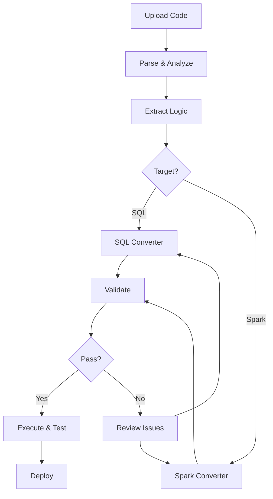

# NeuroLake Migration Module

## AI-Driven Code Migration Platform

The NeuroLake Migration Module is a comprehensive, AI-powered solution for migrating legacy code to modern platforms with **100% logic preservation guarantee**.

## Supported Migrations

### Source Platforms

#### SQL Databases
- Oracle (PL/SQL)
- Microsoft SQL Server (T-SQL)
- PostgreSQL
- MySQL
- IBM DB2
- Teradata
- Snowflake

#### ETL Tools
- **Talend** (versions 7.x, 8.x)
- **IBM DataStage** (versions 11.x, 11.5, 11.7)
- **Informatica PowerCenter** (versions 10.x, IICS)
- **Microsoft SSIS** (2016, 2017, 2019, 2022)
- **Pentaho Data Integration** (8.x, 9.x)
- **Ab Initio** (3.x, 4.x)
- **Oracle BI** (12c)

#### Mainframe
- **COBOL** programs
- **JCL** (Job Control Language)
- **REXX** scripts
- **PL/I** code

### Target Platforms

- **SQL**: PostgreSQL, MySQL, Snowflake, Amazon Redshift, Google BigQuery
- **Spark**: Apache Spark 3.x (PySpark)
- **Databricks**: Delta Lake, Databricks SQL

## Key Features

### 1. AI-Powered Code Analysis
- Deep understanding of business logic
- Automatic extraction of transformations
- Complete data lineage tracking
- Dependency analysis

### 2. 100% Logic Preservation
- Multi-stage validation
- Automated testing framework
- Logic equivalence verification
- Edge case handling validation

### 3. Comprehensive Parsers
- SQL parser with dialect-specific support
- ETL tool parsers (XML, proprietary formats)
- Mainframe code parsers
- Custom format support

### 4. Intelligent Conversion Agents
- **SQL-to-SQL Agent**: Converts between SQL dialects
- **ETL-to-Spark Agent**: Transforms ETL jobs to PySpark
- Optimization recommendations
- Performance tuning

### 5. Automated Validation
- Syntax validation
- Semantic equivalence checking
- Data type compatibility
- Performance benchmarking
- **99%+ validation score required to pass**

### 6. Data Connectors
- Connect to multiple data sources
- Automatic schema inference
- Data quality validation
- Test data generation

### 7. Execution Engine
- Execute converted SQL
- Run Spark jobs
- Real-time monitoring
- Performance metrics
- Results comparison

### 8. Interactive Dashboard
- Web-based UI (Streamlit)
- Upload and parse code
- View extracted logic
- Monitor conversions
- Validate results
- Track migration history

## Architecture

```
migration_module/
├── __init__.py
├── config.py                      # Configuration
├── upload_handler.py              # File upload management
├── logic_extractor.py             # Business logic extraction
├── migration_dashboard.py         # Streamlit dashboard
├── execution_engine.py            # Job execution
├── parsers/
│   ├── __init__.py
│   ├── sql_parser.py             # SQL parser
│   ├── etl_parser.py             # ETL tools parser
│   └── mainframe_parser.py       # Mainframe parser
├── agents/
│   ├── __init__.py
│   ├── sql_converter_agent.py    # SQL conversion agent
│   └── spark_converter_agent.py  # Spark conversion agent
├── validators/
│   ├── __init__.py
│   └── validation_framework.py   # Validation framework
└── connectors/
    └── data_connector.py         # Data source connectors
```

## Installation

```bash
# Install dependencies
pip install -r requirements.txt

# Set API key (required for AI features)
export ANTHROPIC_API_KEY='your-api-key-here'
```

## Usage

### 1. Start the Dashboard

```bash
cd migration_module
streamlit run migration_dashboard.py
```

### 2. Upload Code

1. Navigate to "📤 Upload & Parse"
2. Upload your SQL, ETL, or mainframe code
3. Code is automatically detected and parsed

### 3. Extract Logic

1. Go to "🧠 Logic Extraction"
2. Click "Extract Logic"
3. Review business rules, transformations, and data lineage

### 4. Convert Code

#### SQL to SQL:
1. Navigate to "🔄 SQL to SQL"
2. Select source and target dialects
3. Choose optimization level
4. Click "Convert SQL"

#### ETL to Spark:
1. Navigate to "⚡ ETL to Spark"
2. Select Spark version
3. Choose Delta Lake option
4. Click "Convert to Spark"

### 5. Validate

1. Go to "✅ Validation"
2. Click "Run Full Validation"
3. Review validation report
4. Address any issues
5. **Must score 99%+ to pass**

### 6. Execute & Test

1. Navigate to "▶️ Execute & Monitor"
2. Connect to data source
3. Execute converted code
4. Compare results with original

## Programmatic Usage

```python
from migration_module import (
    UploadHandler,
    LogicExtractor,
    SQLConverterAgent,
    SparkConverterAgent,
    ValidationFramework
)

# 1. Upload and parse
handler = UploadHandler()
metadata = handler.save_upload('procedure.sql', sql_content)

# 2. Extract logic
extractor = LogicExtractor(api_key='your-key')
logic = extractor.extract_logic(sql_code, 'sql', parsed_data)

# 3. Convert SQL
converter = SQLConverterAgent(api_key='your-key')
result = converter.convert(
    original_sql=sql_code,
    source_dialect='oracle',
    target_dialect='postgresql',
    extracted_logic=logic
)

# 4. Validate
validator = ValidationFramework(api_key='your-key')
validation = validator.validate_migration(
    original_code=sql_code,
    converted_code=result['converted_sql'],
    original_platform='oracle',
    target_platform='postgresql',
    extracted_logic=logic
)

# 5. Check results
if validation['passed']:
    print(f"✅ Migration validated: {validation['overall_score']:.1%}")
    print(result['converted_sql'])
else:
    print(f"❌ Validation failed: {validation['overall_score']:.1%}")
    print("Issues:", validation['critical_issues'])
```

## Validation Process

The migration validation ensures 100% accuracy through:

1. **Logic Preservation** (100 points)
   - Every business rule verified
   - All transformations validated
   - No logic changes or omissions

2. **Syntax Correctness** (100 points)
   - Valid target platform syntax
   - No syntax errors
   - Proper formatting

3. **Semantic Equivalence** (100 points)
   - Same behavior as original
   - Identical outputs
   - Edge cases handled

4. **Data Type Compatibility** (100 points)
   - Correct type mappings
   - No precision loss
   - NULL handling preserved

5. **Edge Case Handling** (100 points)
   - NULL values
   - Empty sets
   - Boundary conditions

6. **Error Handling** (100 points)
   - Error conditions caught
   - Proper error messages
   - Graceful degradation

7. **Performance** (100 points)
   - Similar performance characteristics
   - Optimizations applied
   - Scalability maintained

**Total: 700 points**
**Passing: 690+ (99%)**

## Configuration

Edit `config.py` to customize:

```python
# AI Model Configuration
AI_CONFIG = {
    'code_parser': {
        'model': 'claude-sonnet-4',
        'temperature': 0.1,
        'max_tokens': 8000
    },
    'code_generator': {
        'model': 'claude-opus-4',
        'temperature': 0.0,
        'max_tokens': 32000
    }
}

# Migration Settings
MIGRATION_SETTINGS = {
    'validate_logic_100_percent': True,
    'optimize_code': True,
    'generate_documentation': True,
    'create_test_data': True
}
```

## Workflow



## Best Practices

1. **Always validate** before deployment
2. **Test with real data** in non-production environment
3. **Compare results** between original and converted
4. **Review AI suggestions** - human oversight crucial
5. **Keep backups** of original code
6. **Document changes** and migration decisions
7. **Run performance benchmarks**
8. **Conduct UAT** (User Acceptance Testing)

## Troubleshooting

### Validation Score < 99%

1. Review validation report
2. Check critical issues
3. Refine conversion
4. Re-run validation
5. Iterate until passing

### Conversion Errors

1. Check input file format
2. Verify platform detection
3. Review extracted logic
4. Try different optimization level
5. Contact support with error details

### Performance Issues

1. Enable caching
2. Optimize join strategies
3. Review partitioning
4. Add appropriate indexes
5. Use Delta Lake for Spark

## Support

- Documentation: See inline code documentation
- Issues: Create detailed bug reports
- Feature Requests: Submit enhancement proposals

## Roadmap

- [ ] Real-time collaboration
- [ ] Git integration
- [ ] CI/CD pipeline integration
- [ ] More source platforms
- [ ] Advanced optimization techniques
- [ ] Machine learning for pattern recognition
- [ ] Automated performance tuning

## License

Proprietary - NeuroLake Platform

---

**Built with ❤️ using Claude AI and Anthropic API**
